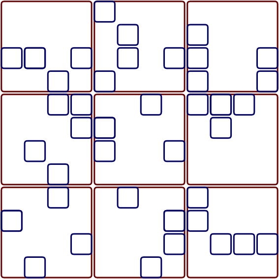
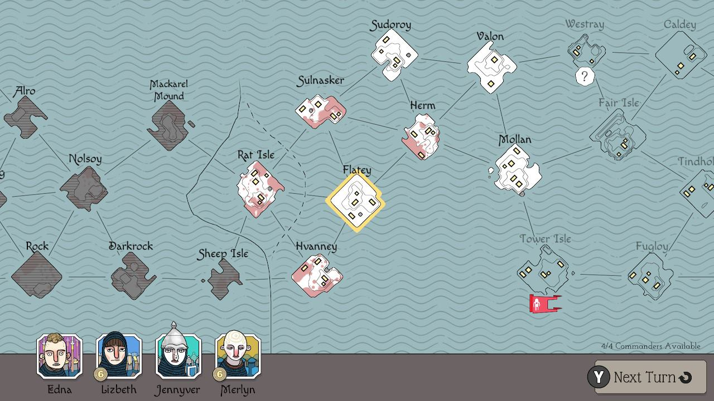
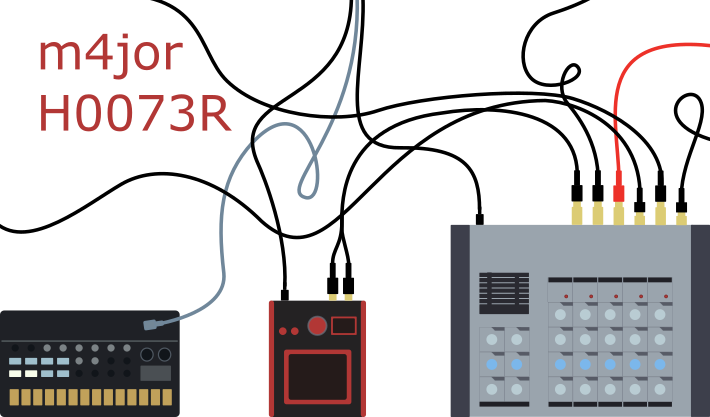

# vector-synth

## latest output

## inspiration:
Bad North game map            |  table hooter verctor graphics
:-------------------------:|:-------------------------:
  |  

## MVP definition of Done

The idea here is to guard against feature creap. 
This is the desired output:
__from command line, output a single, series or grid of synths.__
These are the features of the project
that I would consider to be necessary to have a finished draft
- varying size rectangular based top level containers
- place and split methods for child containers
    - place to add a child container, 
    - split a container in to two child containers
- children can be rendered as one of:
    - button
    - keyboard
    - speaker
    - slider
    - text label (can be indicative, ie series of blobs rather than real text)
    - arrays of buttons and sliders
- fixed set of color palletes, with features randomly selected from them

## Generative vector art
Initial idea is to have a little synth front panel generator inspired by the work I have been doing on the hoot stickers in inkscape.
can split the program into 3 parts.
Motivated by drawing simple flat vector art from bad photos of little childrens synths[IMAGE]. I was interested in keeping the drawings to simple geometric shapes with rounded corners and flat colors. It struck me that they might be kind of interesting to see what they look like without having a persons input. hence generative synth front panels.
Heres how the code might look:
- Component structure to hold the necessary information for an object. objects are squares/rectangles/circles. Should be extensible to be able to act as containers for other objects. ie. the bounding box is the same kind of object as a rectangular button. objects need to be able to be preset, and easily changeable.
- Place structure to generate and arrange ojects, check for conflicts and then alter the objects. This will have to have some kind of decision change to fit the components. Might be at this level where min max component sizes, number of components etcetera will be held (maybe could be stored at the object level instead)
-Place should snap to a grid to make sure that there is some semblance of alignment
- Render structure for rendering the data structures. can include things like color palette, curving. should be able to generate a wireframe, and would probably be most effective if it acted on a data object (YAML) output from any structure to allow re rendering, and step by step rendering for generation process. Could be done with cairo to leverage existing experience.
### Place algorithm
#### Settings for Place:
- bounding container parameters
- min/max number of containers
- container size/shape distributions
- collision distance for containers could be a render distance within the container rather than a collision distance outside the container. both achieve the same result when looking for spaced elements.
#### Steps for Place
- generate bounding container
- select random grid in container to add element to.
  - add element
  - check parameters for colision
  - modify
- select next _free_ grid point in container and add.
- if a component is an array then populate
### Proof of concept:
- Containers that do not intersect, and can be nested and adjacent.
  - containers need an get area method that lets place querry what would be inside them
  - containers need to take dimensions and then generate a collision box. ie x,y,l,w and then l,w plus minus collision distance (or consider render distance within container, instead of collision box outside container)
- Draw square wireframe from a container object, with collisions and centers.
- wireframes colored by type?
- Place a bounding container in image (centered), and then place other objects inside it

### Minimum viable v1.00- backyard session level output
Minimum viable product is to have a selection of images that could be shown at a backyard session type event.
- Render needs to be able to draw a finished image from a data structure.
- Render should include rectangles and circles and arrays/grids/collections? maybe collections need to be other data types
- Components should be rectangles and circles. can use rectangular bounding boxes for circles at this stage for exclusion

### Issues
arrays vs grid snapping.
grid snapping is for alignment at regular intervals, but might be finer than the regular intervals necessary for for an array of buttons
- grid snapping could be achieved by rounding all values, centers and sizes, to fractions of the parent containers length scale
